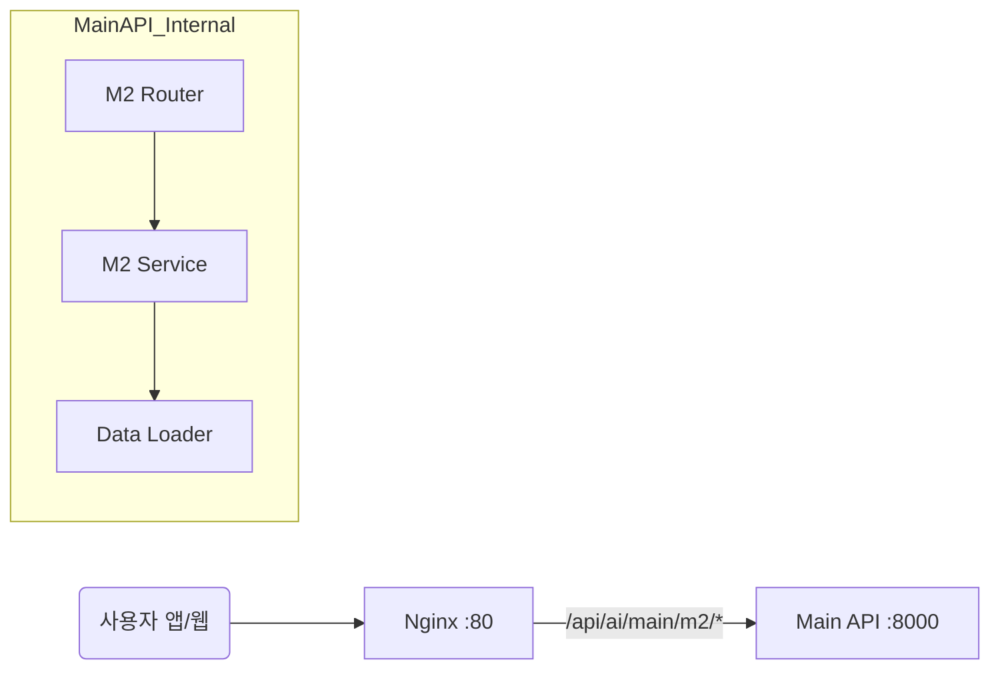

# 🏗️ M5 프로젝트 배포 및 실행 구조도 (ver. M2 안심경로)

## 1. 🌍 전체 시스템 아키텍처 (AWS EC2)

단일 EC2 인스턴스 내에서 3개의 주요 백엔드 서비스가 독립된 환경에서 실행되며, **M2(안심 경로)** 모듈은 **Main API (Port 8000)** 내부에서 M5(방문자 예측)와 함께 동작합니다.

### 📦 서버 구성 (Directory & Environment)

```bash
/home/ubuntu/
├── springboot/           # [메인 백엔드] (Port 8080)
│
├── main-api/            # [AI 허브 서버] (Port 8000)
│   ├── env: Python 3.10 (venv)
│   ├── modules:
│   │   ├── m5/          # 방문자 예측 모듈
│   │   └── m2/          # 🆕 [M2 안심 경로 모듈]
│   │       ├── router.py   # API 엔드포인트
│   │       ├── service.py  # 경로 탐색 로직 (A*)
│   │       ├── loader.py   # DB/CSV 데이터 로드
│   │       └── data/       # CCTV, 구역 데이터
│
└── p2pnet-api/          # [영상 분석 서버] (Port 8001)
```

---

## 2. 🚦 네트워크 흐름 (Nginx Routing)

M2 기능에 대한 요청은 Nginx를 통해 `main-api`로 라우팅됩니다.



---

## 3. 🔄 데이터 처리 흐름 (M2 안심 경로)

1.  **데이터 동기화 (Startup / Periodic)**
    *   **M2 Loader**: `Supabase` DB 연결
    *   **Query**:
        *   `DAT_Crowd_Detection` (실시간 혼잡도)
        *   `COM_CCTV` (CCTV 좌표)
        *   `JOIN`하여 최신 혼잡도 매핑
    *   **M2 Service**: 로드된 데이터를 기반으로 `OSMnx Graph` 가중치(Penalty) 업데이트

2.  **경로 요청 (User Request)**
    *   **App/Web** -> `POST /m2/route` (출발지, 도착지)
    *   **M2 Service**:
        *   메모리 상의 그래프(`G`)에서 **A* 알고리즘** 수행
        *   혼잡도 높은 구간(Red Zone) 회피 비용 계산
    *   **Response**: `[{lat, lng}, ...]` 경로 좌표 리스트 및 `소요 시간(분)` 반환

3.  **시각화 (Optional Debugging)**
    *   `GET /m2/heatmap`: 현재 적용된 혼잡도 히트맵 데이터 반환
    *   `GET /m2/cctv`: 활성화된 CCTV 위치 및 밀집도 반환

---

## 4. 🛠️ 배포 및 실행 가이드

### 1) 라이브러리 설치
`main-api`의 가상환경(venv) 내에서 설치:
```bash
pip install -r package/m2/requirements.txt
```

### 2) 환경 변수 설정 (.env)
`main-api` 루트의 `.env` 파일에 추가:
```env
GOOGLE_MAPS_API_KEY=your_key
SUPABASE_URL=your_url
SUPABASE_KEY=your_key
```

### 3) 메인 앱 통합 (main.py)
```python
from package.m2.router import router as m2_router
app.include_router(m2_router)
```

